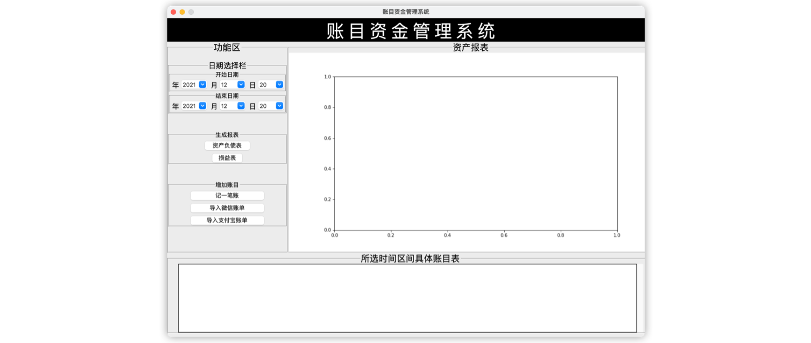
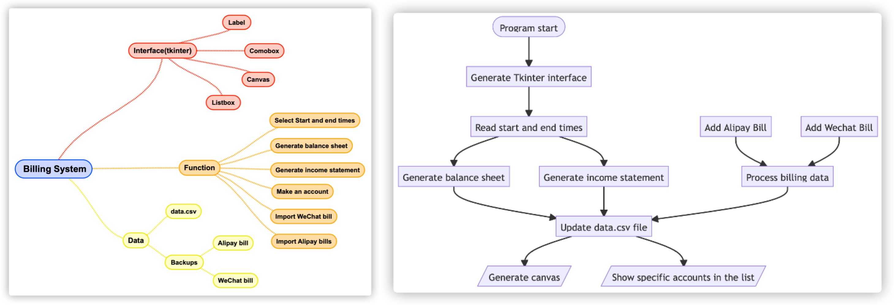
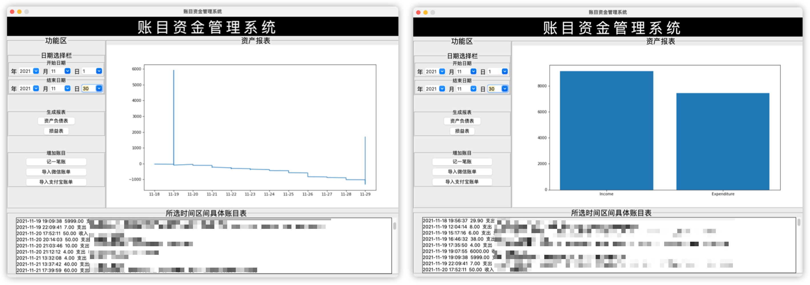
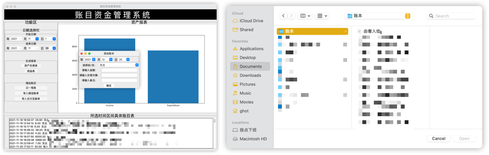

  
  <h1 style="text-align: center;">Budget Buddy</h1>

A personal finance management tool, allowing users to import and manually enter WeChat and Alipay bills, analyze and
generate comprehensive financial statements.

1. When the program starts, Tkinter will automatically generate the interface, which includes the function area, chart
   area, and specific account area.
2. First, select the start date and end date to set the time interval you want to query.
3. Next, click on the balance sheet and income statement buttons to traverse the data in the CSV file and generate the
   charts.
4. Simultaneously, the detailed bills within the selected time frame will be enumerated and listed in the list box.
5. If users want to add their accounts, they can click the button to import Alipay or WeChat bills.
6. The program supports automatic processing of Alipay and WeChat bills and creates backup copies within the program.
7. The program also allows adding a single account. Clicking the corresponding button will pop up a window for users to
   enter the relevant information.

# Main Features

- Create an interactive interface using Tkinter.
- The interface includes buttons, listboxes, labelframes, comboboxes, canvases, and labels.
- Utilize Matplotlib for drawing charts and graphs.
- Save data in CSV file format for processing and operations.

- [x] Design the GUI using Tkinter with a logical and user-friendly window layout.
- [x] Enable recording of individual accounts and writing them to data.csv.
- [x] Implement functionality to import WeChat and Alipay bills.
- [x] Develop methods to sort and analyze billing documents.
- [x] Create processes to generate income statements and balance sheets.
- [x] Display all accounts within the selected time period.

# Design Scheme

> Module Diagram and Flow Chart

# Instructions

## Preparation

- Install the os, datetime, calendar, shutil, matplotlib, subprocess and tkinter modules.
- Run the main.py to start program.

## Generate report

Select the time and click the button to generate balance sheet or income statement.

## Add a record or import a bill file

Click to record an account and a window will pop up. Clicking import bill will pop up a window to select a file.

